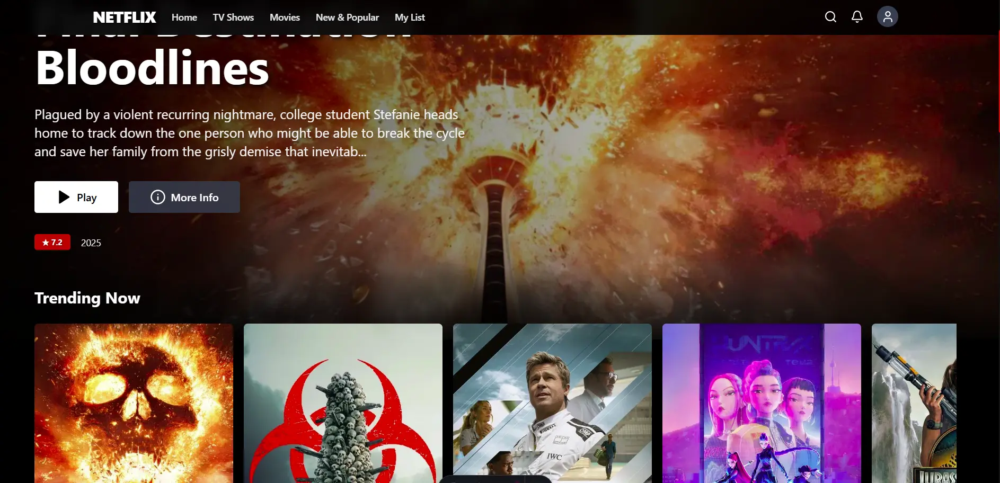

# Netflix Clone 🎬

A Netflix-inspired movie streaming interface built with Astro, React, and TypeScript. Features real movie data from TMDB API, including ratings, descriptions, and trailer integration with a clean, responsive design.

## 📸 Screenshot



## ✨ Features

- 🎥 **Real Movie Data** - Integrated with TMDB API for authentic content
- ⭐ **Movie Ratings** - Display IMDb ratings and user scores
- 📝 **Detailed Descriptions** - Comprehensive movie information and overviews
- 🎬 **Trailer Integration** - Watch movie trailers directly in the interface
- 🎞️ **Multiple Categories** - Trending, Popular, Top Rated, Now Playing, Upcoming
- 📱 **Fully Responsive** - Optimized for desktop, tablet, and mobile
- ⚡ **Fast Performance** - Built with Astro for optimal loading speeds
- 🎨 **Modern UI** - Clean interface inspired by Netflix design

## 🛠️ Tech Stack

- **Framework:** Astro 4.x
- **Frontend:** React 18 + TypeScript
- **Styling:** Tailwind CSS
- **API:** The Movie Database (TMDB)
- **Icons:** Lucide React
- **Build Tool:** Vite

## 🚀 Quick Start

### Prerequisites

- Node.js 18+ 
- npm or pnpm
- TMDB API Key ([Get it here](https://www.themoviedb.org/settings/api))

### Installation

1. **Clone the repository**
   ```bash
   git clone https://github.com/AlxAleman/netflix-clone.git
   cd netflix-clone
   ```

2. **Install dependencies**
   ```bash
   npm install
   # or
   pnpm install
   ```

3. **Set up environment variables**
   ```bash
   # Create .env file and add your TMDB API key
   TMDB_API_KEY=your_api_key_here
   ```

4. **Start development server**
   ```bash
   npm run dev
   # or
   pnpm dev
   ```

5. **Open your browser**
   ```
   http://localhost:4321
   ```

## 📁 Project Structure

```
netflix-clone/
├── public/
│   ├── alex-logo.ico
│   ├── alex-logo.png
│   ├── favicon.svg
│   └── netflix-clone.webp
├── src/
│   ├── components/
│   │   ├── Header.tsx
│   │   ├── Hero.tsx
│   │   ├── LazyImage.tsx
│   │   ├── MovieCard.tsx
│   │   ├── MovieRow.tsx
│   │   ├── NetflixApp.tsx
│   │   ├── SkeletonLoader.tsx
│   │   └── TrailerModal.tsx
│   ├── layouts/
│   │   └── Layout.astro
│   ├── pages/
│   │   ├── api/
│   │   │   └── search.ts
│   │   └── index.astro
│   ├── services/
│   │   └── tmdb.ts
│   └── types/
│       └── movie.ts
├── .env
├── astro.config.mjs
├── package.json
├── tailwind.config.cjs
└── tsconfig.json
```

## 🎬 TMDB Integration

The app fetches real movie data from The Movie Database API:

- **Movie Information** - Titles, descriptions, release dates
- **Ratings & Scores** - IMDb ratings and user scores
- **Movie Posters** - High-quality movie artwork
- **Trailers** - Official movie trailers and teasers
- **Categories** - Trending, Popular, Top Rated, Now Playing, Upcoming

## 🔧 Available Scripts

```bash
npm run dev          # Start development server
npm run build        # Build for production
npm run preview      # Preview production build
```

## 🌐 Deployment

### Vercel (Recommended)
1. Push your code to GitHub
2. Connect repository to Vercel
3. Add `TMDB_API_KEY` environment variable
4. Deploy automatically

## 🎨 Customization

### Personal Logo
The header includes a personal logo. Replace `/public/alex-logo.png` with your own:

```tsx
// src/components/Header.tsx

```

## 📄 License

This project is licensed under the MIT License.

## 🙏 Acknowledgments

- [TMDB](https://www.themoviedb.org/) - Movie data and API
- [Astro](https://astro.build/) - Static site generator
- [React](https://reactjs.org/) - UI library
- [Tailwind CSS](https://tailwindcss.com/) - CSS framework

## 📞 Contact

Alex Alemán
---

⭐ **Star this repository if you found it useful!**